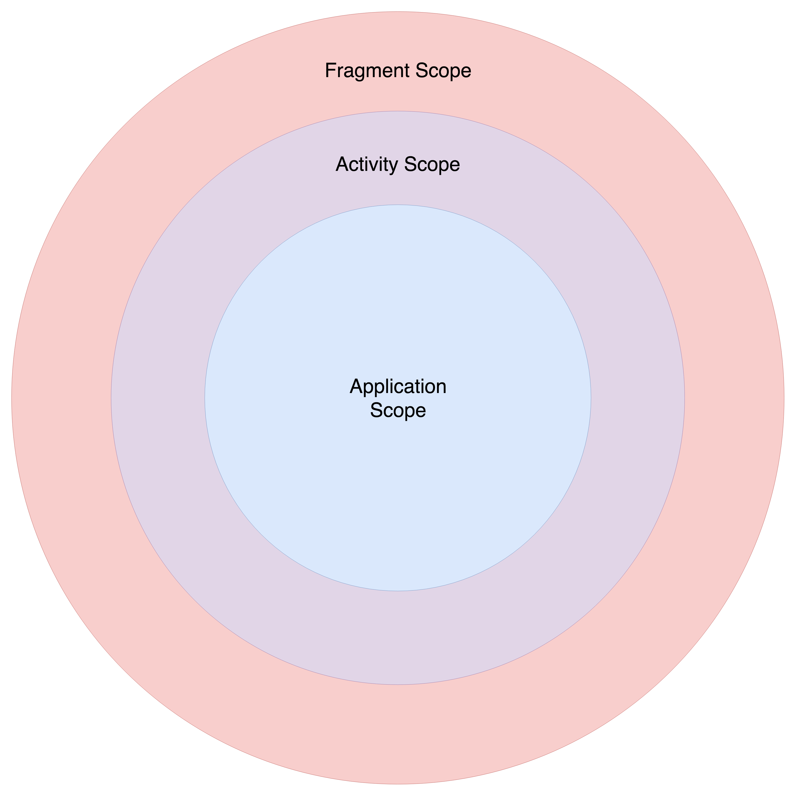
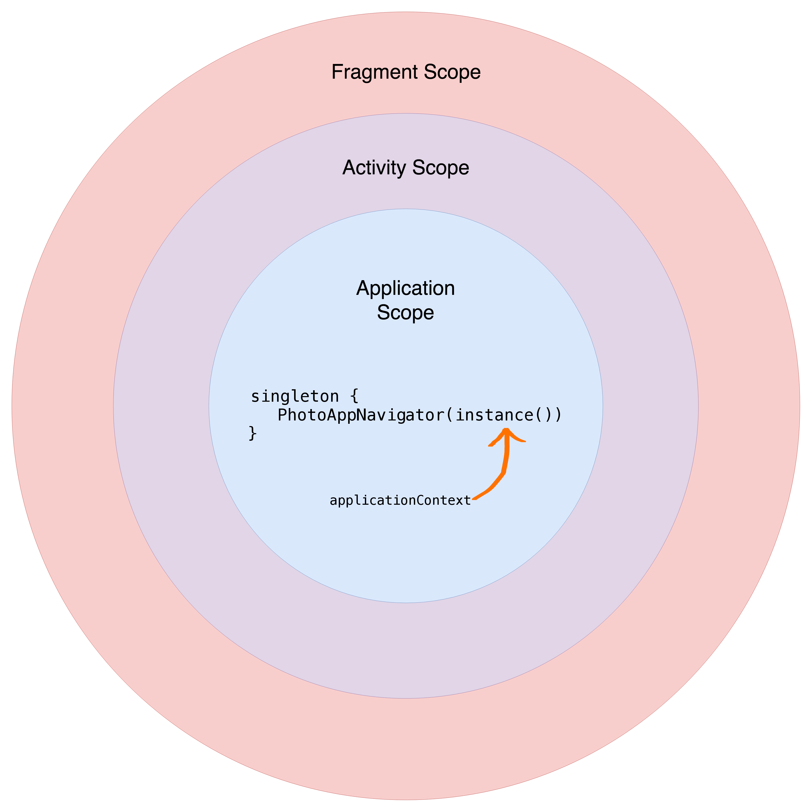
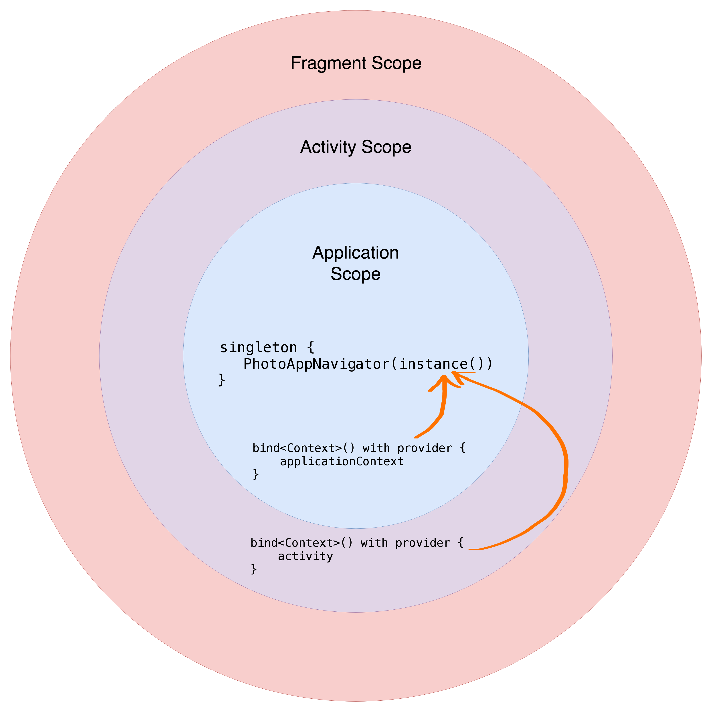

autoscale: true
footer: [caster.io - Dependency Injection in Android using Kodein](https://www.caster.io)
slidenumbers: true

---

---

---

## __Runtime exception!__ :boom:
## "There's a binding already defined for the type Interceptor"

### __Not allowed:__ Binding two different implementations to one type.

---

## __Binding overrides__ to the rescue!

