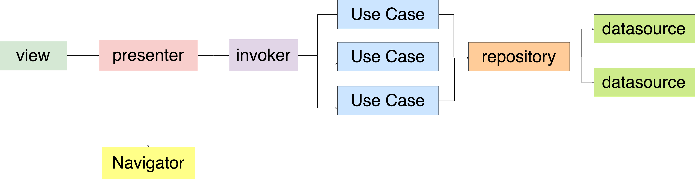
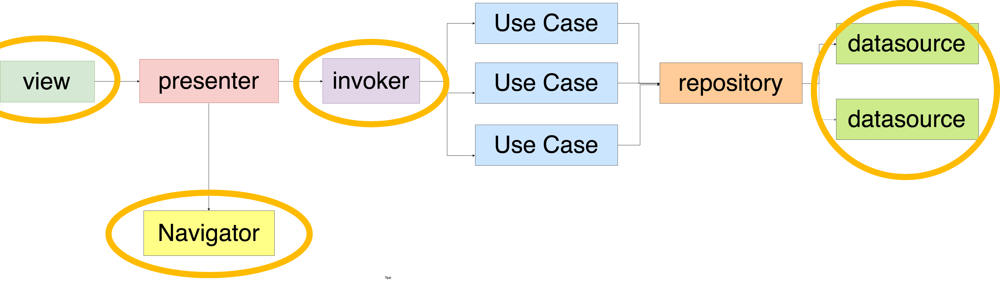

autoscale: true
footer: [caster.io - Dependency Injection in Android using Kodein](https://www.caster.io)
slidenumbers: true

# "Testing your architecture"
## (__mock injection__)

---

## Thinking before testing 🤔

* Be smart about __the scope__
* Be smart about __the tests you wanna write__
* Be smart about __how to add value__

---

## What would I test?

## __Remove frameworks__!

---

---

